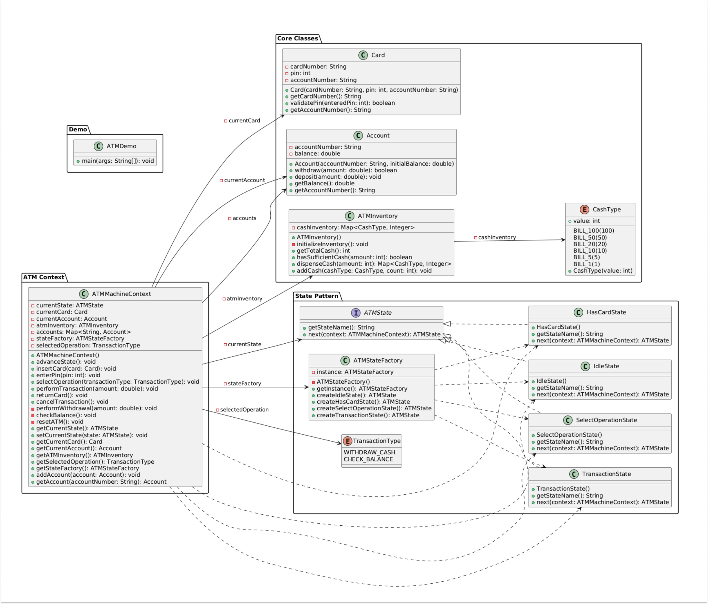
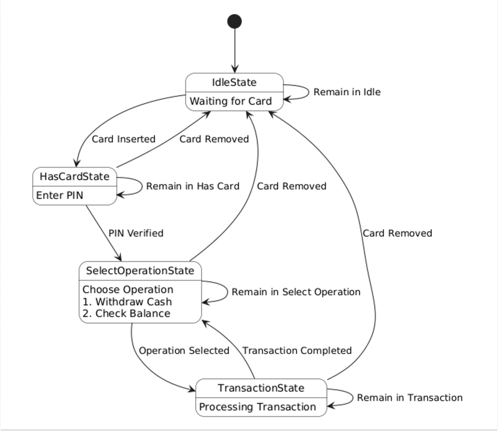

<H1>Design ATM Machine</H1>

Great! Before diving into the design, I'd like to clarify a few requirements:

• What types of operations should the system support?

• How should the system handle user authentication?

• Are there specific states the ATM should manage?

<h3>Point 2 : Clarifying Requirements</h3>
Interviewer: We want a system that:

• Supports basic operations like cash withdrawal and balance checking.

• Handles card insertion and PIN-based authentication.

• Manages the state transitions of the ATM during operations.

Candidate: To summarize, the key requirements are:

• A system that authenticates users via card and PIN.

• State management to handle the flow from card insertion to transaction completion.

• Support for basic banking operations (withdraw cash, check balance).

• Ability to handle edge cases like incorrect PIN, insufficient funds, or machine maintenance.

Interviewer: Perfect, let's proceed.

<h3>Point 3: Identifying Key Components: </h3>

Candidate: Now that we have the requirements, let's identify the key components of our ATM

Machine System:

• Card: Represents user's bank card with card number and PIN.

• Account: Contains user account details including balance.

• Cash: Represents different denominations of cash in the ATM.

• ATM Inventory: Manages the cash inventory in the ATM.

• ATM Machine: Contains the core functionality and manages operations.

• Transaction Type: Represents different types of transactions.

<h3>Point 4: Design Challenges: </h3>
Interviewer: What design challenges do you anticipate?

Candidate: The key challenges for the ATM Machine System include:

• State Management: Properly transitioning between different machine states.

• Authentication: Securely validating user credentials.

• Transaction Processing: Handling different transaction types correctly.

• Error Handling: Managing scenarios like incorrect PIN, insufficient funds, or hardware failures.

• Inventory Management: Ensuring accurate cash tracking and availability.

<h3>Point 5: Approach:</h3>
Interviewer: How would you approach these challenges?

Candidate: I propose using design patterns effectively. Here are my strategies:

<b>State Pattern for ATM States:</b>

• Encapsulates state-specific behavior.

• Manages transitions between states (idle, has card, select operation, cash withdrawal, check balance).

• Prevents invalid operations based on current state.

<b>Factory Pattern for Creation of ATM States :</b>

• Centralizes creation of state objects

• Decouples client code from concrete state implementations

• Allows for easy extension with new states

<h3>Point 6: Implementation:</h3>
Interviewer: Ready to discuss implementation?

Candidate: Yes. I'll focus on implementing the design patterns we discussed and show how they work together in the ATM
Machine Problem:

ATM Machine Design with Design Patterns :

State Diagram :

